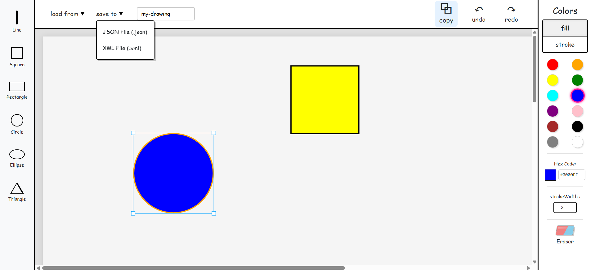

# Paint Web App

This is a university assignment for Programming 2 course at Alexandria University CSED.

A web-based drawing and painting application supporting multiple geometric shapes, coloring, resizing, moving, copying, deleting, and undo/redo functionality. It also allows saving and loading drawings in XML and JSON formats.

## Dataset / Input Format
The input consists of user mouse interactions on the HTML canvas to draw and manipulate shapes, as well as JSON/XML files for loading previously saved canvases.

## Design Choices
- **Frontend**: Angular with Konva.js for canvas rendering, chosen for strong component architecture and efficient 2D graphics handling.
- **Backend**: Java Spring Boot to provide a robust RESTful API.
- **Save/Load Format**: Both XML and JSON are supported to ensure compatibility and adhere to assignment requirements.

## Algorithms / Approach
- **Design Patterns**: 
  - **Prototype Pattern**: Used for cloning shapes.
  - **Factory Pattern**: Used for instantiating different geometric shapes.
- **Undo/Redo**: Implemented using a history stack that records actions or canvas states.
- **Polymorphism**: Used heavily in the backend to manage different geometric shape types (Line, Circle, Rectangle, etc.) uniformly.

## Project Structure
- `FrontEnd/paint/`: Angular single-page application (UI, Canvas, Tools).
- `BackEnd/`: Java Spring Boot application (REST Controllers, Shape Models, Save/Load Services).

## How to Run
### Backend
1. Navigate to `BackEnd/`
2. Run `mvnw spring-boot:run`
### Frontend
1. Navigate to `FrontEnd/paint/`
2. Run `npm install`
3. Run `npm start` (or `ng serve`)
The app will be available at `http://localhost:4200`.

## Observations / Known Limitations
- State management might consume high memory if the undo/redo history stack grows indefinitely.

## Screenshots

### Main Workspace

## Contributors
- [@AnasAli77](https://github.com/AnasAli77)
- [@BigadElsayed](https://github.com/BigadElsayed)
- [@tofyfathy12](https://github.com/tofyfathy12)
- [@Joo-Ashraf1](https://github.com/Joo-Ashraf1)
